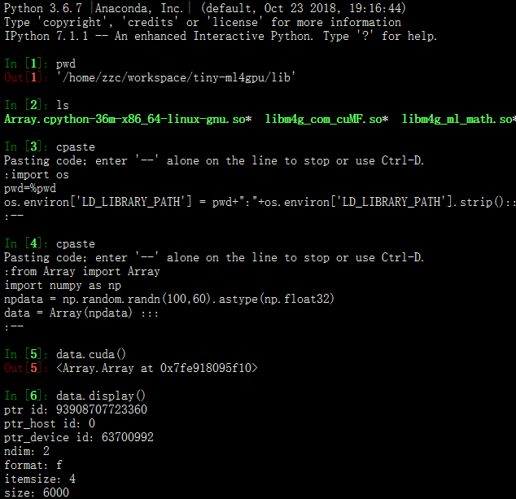

# tiny-ml4gpu
use cuda to coding the machine learning and deep learning models.  

firstly, use cuda to coding the base part, then, use pybind11 to wrapper the .cu into .cpp, so we can use python to import the model .

## Example
like this, firstly, you should transfer data from cpu host onto gpu device:  

TODO:  
in the future, the ml4gpu project will have three version:  
1 - (now, working on this)only use cuda api and little cublas or cusolver api. the project only support single machine one GPU card; this version will be dirty, because i'm always trying different way and changing the architecture just for knowing someting.
    
2 - make it support single machine multi-GPU by openMP and pthreads and so on;    

3 - make it support multi-machine multi-GPU by MPI and openMP and pthreads and so on.   
